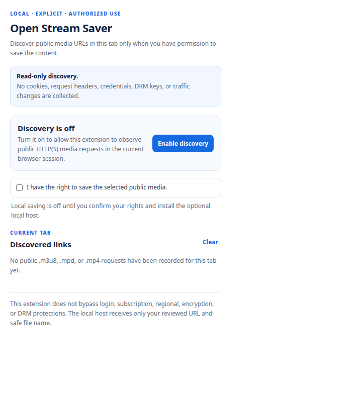
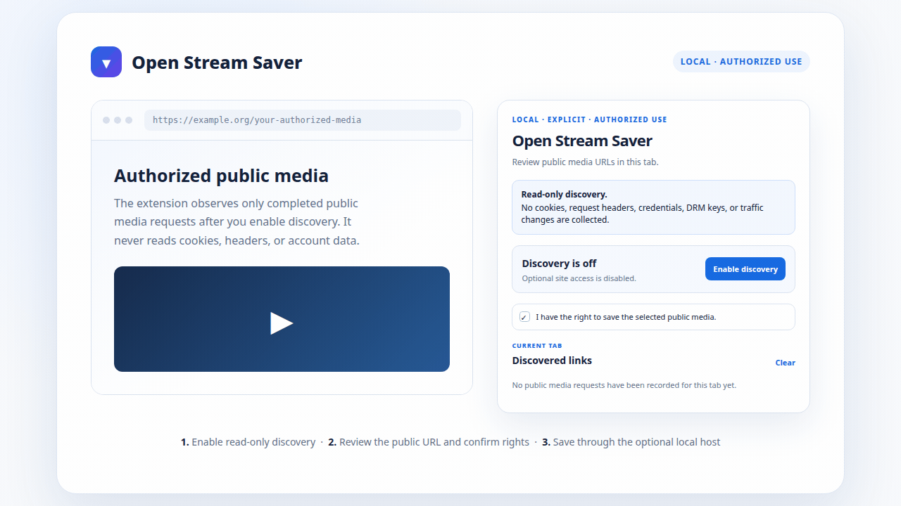

<div align="center">

# 把已获授权的公开媒体，留在自己掌握的本地工作流里。

### 本地优先 · 明确授权 · 跨平台工具与持续学习

<p align="center">
  
</p>

<p align="center">
  
</p>

</div>

---

## 代表作品

### [Media Archiver](https://github.com/w1977-0/media-archiver)

**一句话价值主张：**为自己有权保存的公开媒体提供可审阅、授权优先的本地归档流程；从浏览器发现到本机 CLI 保存，全程不导入 Cookie、凭据或 DRM 密钥。

`Go CLI` · `Chrome Manifest V3` · `Native Messaging` · `HLS / DASH` · `FFmpeg` · `Apache-2.0`

Media Archiver 是持续维护的跨平台核心。它支持用户复核公开 URL、明确确认保存权利后，再处理单个直链、已结束的未加密 HLS，或静态未加密 DASH 内容。

[查看 Release](https://github.com/w1977-0/media-archiver/releases) · [阅读项目说明](https://github.com/w1977-0/media-archiver#readme)

```bash
go install github.com/w1977-0/media-archiver/cli/cmd/open-stream-saver@v0.3.1
```

<p align="center">
  
  
</p>

### Media Saver

**研究中的本地工具。**它以 `Python`、`Flask` 与 `Streamlit` 试验更易上手的本机 GUI 流程：链接预览、授权确认与本地保存。它是 Media Archiver 之前的 GUI 探索，不附私有仓库链接；跨平台 CLI 与浏览器扩展能力以 Media Archiver 为正式核心。

---

## 我的学习地图

```text
本地优先的数字工具
├── 用 Git 与 GitHub 记录可复现的迭代
├── 把授权、隐私与安全边界写进工具设计
├── 通过 Go、Python 与浏览器扩展完善小作品
└── 在开源协作中持续学习与贡献
```

| 学习脉络 | 入口与说明 |
| --- | --- |
| **阅读与英语素材** | [Reading Library](https://github.com/w1977-0/reading-library)：保留上游来源的英语阅读学习收藏；对应的[学习笔记](notes/open-source-learning/reading-library.md)记录了运行方式、限制与下一步实验。 |
| **教育与知识资源** | [Learning Library](https://github.com/w1977-0/learning-library)：保留上游来源的教育资源学习收藏；对应的[学习笔记](notes/open-source-learning/learning-library.md)说明资源核验与小规模实验。 |
| **知识笔记** | [Philosophy Notes](https://github.com/w1977-0/philosophy-notes)：用于整理可追溯的学习思考。 |
| **工具探索** | [Content Archiver](https://github.com/w1977-0/content-archiver)、[Article Audio](https://github.com/w1977-0/article-audio) 与 [AI Sentiment](https://github.com/w1977-0/ai-sentiment) 分别对应[归档笔记](notes/open-source-learning/content-archiver.md)、[文章转音频笔记](notes/open-source-learning/article-audio.md)与[舆情分析笔记](notes/open-source-learning/ai-sentiment.md)。 |
| **开源学习笔记总览** | [notes/open-source-learning/](notes/open-source-learning/)：五篇短笔记保留上游归属，分别说明收藏原因、运行方式、观察到的限制与下一步微实验。 |

## 关于我

我把学习当作一条可以被复盘的路径：先确认问题和边界，再完成一个可运行的小工具，最后把过程写成更清楚的文档。这里会持续沉淀对 AI、开源工具、阅读和知识整理的实践记录。

## 我的方向与兴趣

| 方向 | 我正在做的事 |
| --- | --- |
| **本地优先工具** | 在不采集敏感身份材料的前提下，探索可审阅、可复现的个人工作流。 |
| **知识整理** | 把零散灵感、工具和信息整理成以后找得到、说得清的笔记。 |
| **AI 与开源协作** | 学习把需求、测试、文档与小步提交结合为可靠的开源实践。 |
| **作品积累** | 从小工具和学习笔记出发，持续完善可被他人理解与使用的作品。 |

## 今日一言

<!-- DAILY-QUOTE:START -->
> 不要太小看人类了！
>
> —— 加油大魔王
>
> *更新时间：2026-08-22 13:44（北京时间）*
<!-- DAILY-QUOTE:END -->

## 正在学习的工具

<p align="left">
  
  
  
  
  
</p>

## GitHub 公开活动

<p align="center">
  
</p>

> 统计卡片会随公开 GitHub 活动自动更新。若某些网络环境暂时无法加载外部图片，主页的文字内容不会受到影响。

## 收藏说明与交流

学习收藏与 Fork 会保留各自的上游来源；它们构成学习脉络，而不是对原作者作品的重新归属。欢迎围绕阅读、AI 工具、开源协作与本地优先的数字工具交流。

---

<div align="center">

**不断学习 · 持续记录 · 慢慢创造**

</div>
